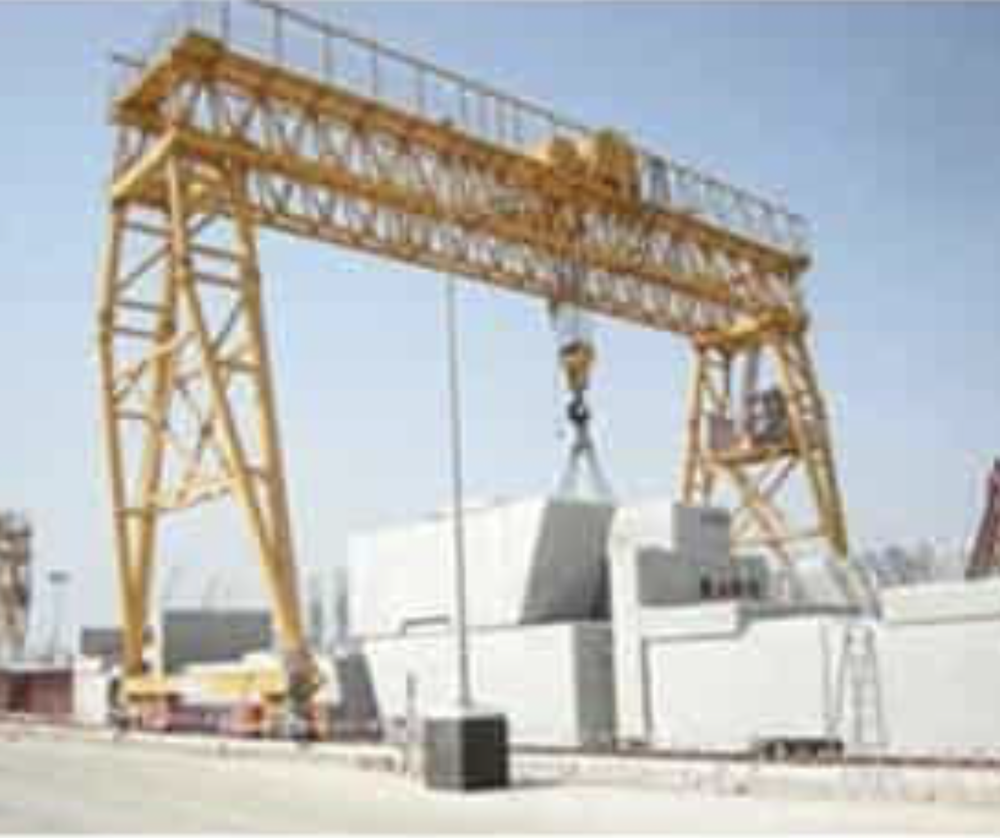
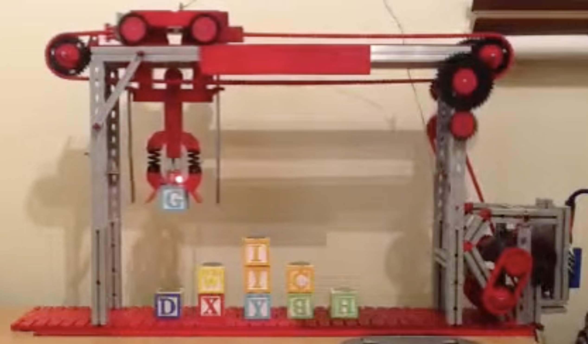

# Crane

## Gantry Crane
The crane project is to have gantry crane that can move both X and Y directions and of course Z-direction to pick up and drop a load. The picture shows how this works in real life.

## Fischertechnik Model
The picture of the gantry crane was captured from a movie on YouTube.

_The aim is to be a bit more ambitious :-)._

## Control Systems
Apart from the design itself, driving the crane safe and efficiently control algorithms can be deployed. One might think that **AI/ML** is needed here, but **Fuzzy Logic** and **PID** control can do the job.

[Anti-sway](Papers/Anti-sway%20tuned%20control%20of%20gantry%20cranes.pdf)

[Fuzzy and PID](Papers/Optimal%20PID%20and%20fuzzy%20logic%20based%20position%20controller%20design%20of%20an%20overhead%20crane%20using%20the%20Bees%20Algorithm.pdf)

________
________

Copyright (c)2026 by Roland van Straten. All Rights Reserved. Commercial in Confidence.