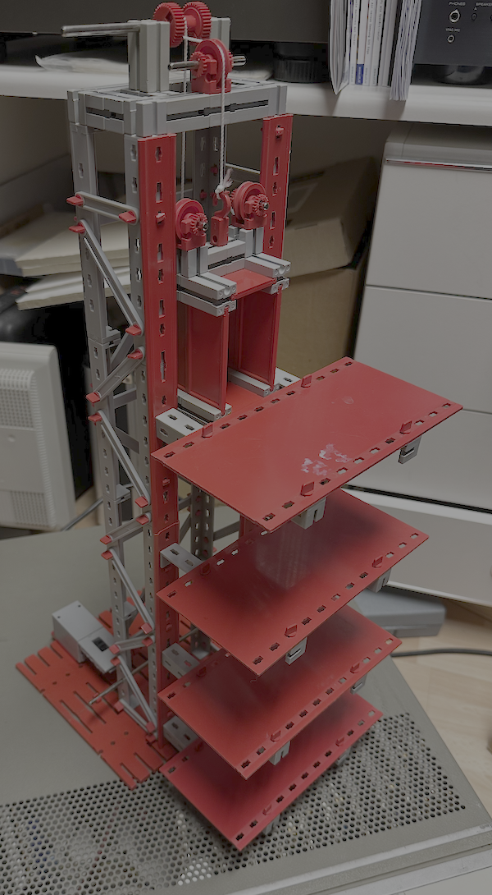
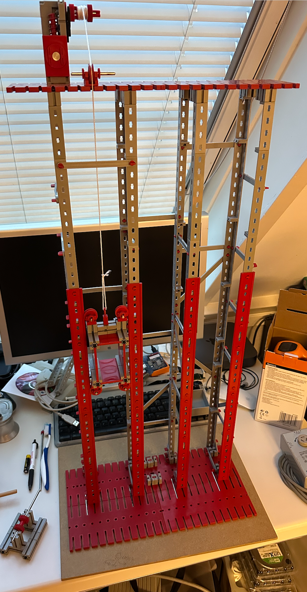

# Two-elevator system
An elevator is an interesting object that does not require a lot of area as it is vertical :-). But controlling just one is not very interesting. Two or three elevators would be more fun.

From experience (about 25 years ago) I made a visualization of eight elevators using MacOS9 for a hotel management system where we could follow the movements and states of the elevators and see them moving on a screen just for fun.

A first single elevator just to get into the mood...

Updated a little...

_Already collecting various data from different sources about elevators and algorithms... _

# Collected Background

## Control Strategies
For a two-elevator system, the most efficient algorithm to maximize speed and minimize passenger wait time is not to have both elevators operate independently. Instead, they should operate as a synchronized group using a combination of _Dynamic Zoning_ and an _Optimized SCAN_ algorithm. 

### Elevator algorithm by Donald Knuth

Elevator algorithm is best explained through Knuth's Elevator algorithm. In simple steps the algorithm can be followed as:

    - Proceed in the same direction until the last request in that direction.

    - If there is no request, stop and proceed towards other direction, if there is any request from other direction.

**See "the art of programming" book series.**

Following is an overview of most effective algorithm for two elevators:

### 1. Optimized Two-Elevator Algorithm: "Dynamic Zoning + Smart SCAN"

To minimize wait time, the elevators should be treated as a single system.

- Dynamic Zoning: When traffic is high, assign one elevator to serve the lower floors and the other to the higher floors. This reduces the number of stops each car makes, thus increasing the average speed and lowering the average journey time.

- Optimal Resting Positions: When idle, instead of having both on the ground floor, place one elevator at the ground floor (for upward traffic) and the other near the middle or top floor (e.g., around the 60-70% mark of the building height) to handle downward traffic faster.

- Smart SCAN (LOOK Algorithm): Instead of moving from the bottom to the top floor (standard SCAN), the elevator should only travel to the highest or lowest request in its current direction, then turn around. This prevents wasting time going to empty, high-rise floors.

- Up-Peak/Down-Peak Optimization:
    - Morning (Up-Peak): Both elevators focus on ground-floor departures.
    - Evening (Down-Peak): Both elevators return to top floors to handle downward flow.

**Article:** [Energy-saving scheduling optimization under up-peak traffic for group elevator system in building](https://www.sciencedirect.com/science/article/abs/pii/S037877881300460X#:~:text=consumption%20a%20lot.-,Abstract,operation%20under%20up%2Dpeak%20pattern.)
    
### 2. Implementation Rules

- Call Allocation: When a hall call (user button press) occurs, the algorithm computes which elevator will arrive first, factoring in current location, direction, and existing stops.

- Capacity Check: Before stopping at a floor, the system checks if the elevator is at capacity.

- Same-Direction Priority: An elevator traveling up should only stop for passengers going up.

- Long Wait Avoidance: If a floor call has been waiting for a long time, its priority is increased, overriding the closest-elevator rule to prevent "starvation" (indefinite waiting). 
    
**Article:** [Stuck between floors how elevator algorithms make us wait and wait and wait](https://medium.com/@mumbaiyachori/stuck-between-floors-how-elevator-algorithms-make-us-wait-and-wait-and-wait-b29e7e4bf728)

### 3. Key Strategies for Maximum Efficiency

| Strategy | Action | Benefit |
|----------|--------|---------|
| Zone Splitting | One car handles lower 50%, one handles upper 50%. | Reduces stops and travel time. |
| Idle Resting | One car at L1, one at middle-upper floors. | Reduces average response time. |
| Directional Priority | Only accept calls in the current direction. | Improves efficiency over simple FCFS. |

For maximum throughput, implement a Destination Control System (if possible), where users select their floor before entering, allowing the algorithm to pre-group people and minimize intermediate stops.

# Pater-noster
Interesting type of elevator that exists both horizontally and vertically is the [paternoster](https://liftforhome.in/paternoster-elevator/). 

# Use CAN?

For lift control there are standards. One of them (CAN-CiA 417) is published by the **[Can in Automation](https://www.can-cia.org)** organisation. However, the complexity to add is **to much** and goes far beyond the goals of the project. Just to satisfy your interest:

[CIA-417 PROFILE](https://www.can-cia.org/can-knowledge/cia-417-series-profile-for-lift-control-systems)

[CANopen Lift](https://en.canopen-lift.org/wiki/Main_Page)

[CANopenTerm](https://canopenterm.de/)

# References

[1](https://jamesiv.es/blog/experiment/2020/05/31/programming-an-elevator/) Programming an Elevator

[2](https://alamrafiul.com/blogs/elevator-problem/) Elevator Problems

[3](https://math.stackexchange.com/questions/2369011/what-is-the-best-rest-position-for-two-elevators-in-a-10-story-building) What is the best rest position for two elevators in a 10 story building

[4](https://propmodo.com/going-up-down-what-does-the-elevators-algorithm-say/) Going up down what does the elevators algorithm say

[5](https://www.tinyepiphany.com/2009/12/elevator-algorithms.html) Elevator algorithms

[6](https://www.sciencedirect.com/science/article/abs/pii/S0952197608000869) Distributed approach to group control of elevator systems using fuzzy logic and FPGA implementation of dispatching algorithms

[7](https://medium.com/@datafreakai/from-disks-to-elevators-applying-scheduling-algorithms-for-optimal-movement-8784fa0ea9e8) From-disks-to-elevators-applying-scheduling-algorithms-for-optimal-movement

[8](https://blackswanfarming.com/scheduling-algorithms-elevator-edition/) Scheduling-algorithms-elevator-edition

[9](https://dev.to/thesaltree/elevator-scheduling-algorithms-fcfs-sstf-scan-and-look-2pae) Elevator scheduling algorithms fcfs sstf scan and look

[10](https://www.popularmechanics.com/technology/infrastructure/a20986/the-hidden-science-of-elevators/) The hidden science of elevators

[11](https://en.wikipedia.org/wiki/Elevator_algorithm) Elevator algorithm

_____
_____

Copyright (c)2026 by Roland van Straten. All Rights Reserved. Commercial in Confidence.

