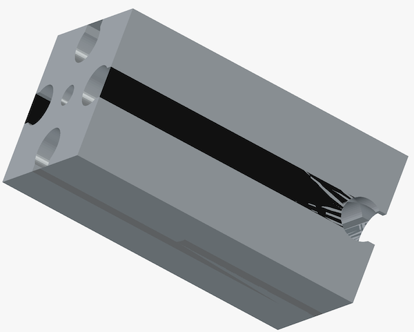
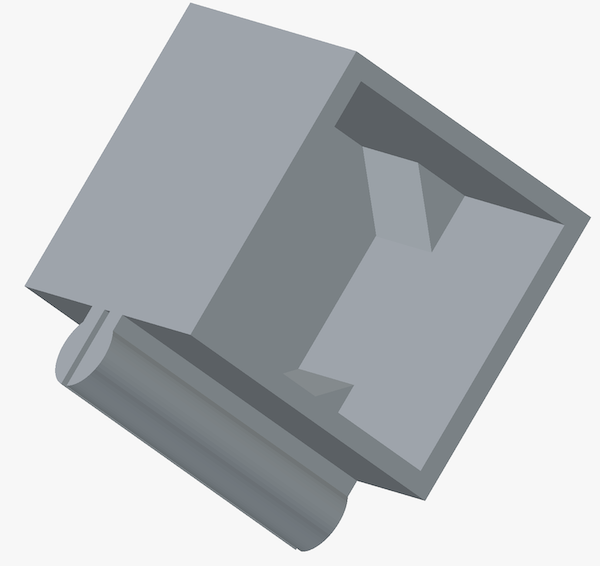
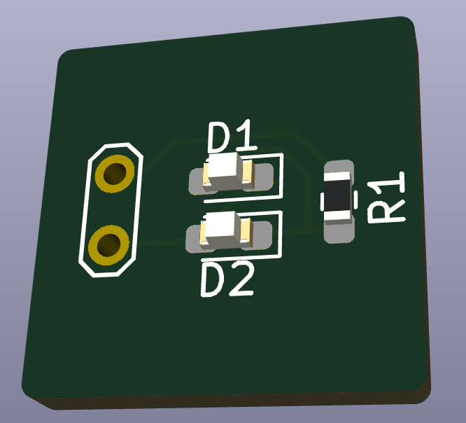
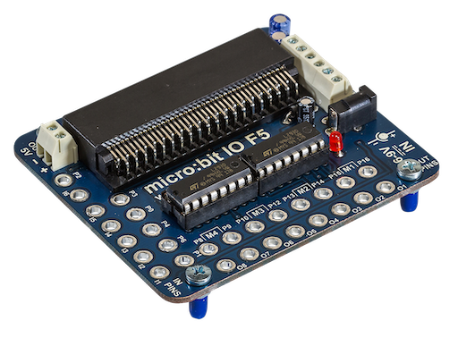

# Fischertechnik Revisited

This repository holds my experiments with Fischertechnik.

Recently I got some old building blocks and accessoires. It is like reliving my youth. Today I can appreciate the powerfullness of the blocks much more and now I can also add thing I like to it.

So now I started this repo. First thing was to create 3D printed blocks that can be used together with the original stuff. The purpose is not to duplicate it, but
be able to add small (electronics based) blocks w/ or w/o pogo pins, small PCB, having sensors and other stuff.

# 3D

In the 3D directory you will find two `NOT VERIFIED YET` blocks that serve as basis to build other blocks. The OpenSCAD source and a `.STL` can be found there.

No part has been printed yet to see if the measures are correct (lacking a 3D printer).

# KiCad

In the KiCad directory you will find projects that can be useful. Expect a sensor PCB that fits one of the 3D designs, H-bridge for the motors and interfaces to `STM32` and/or `BBC micro:bit`.

## Baustein_15_LED

Just for test and fun a dual LED PCB that can hold two different colors or the same colors and will light one or the other LED when a DC voltage is applied. When an AC voltage is applied they both will be on.

## H-Bridge micro:bit

Fischertechnik provides a micro:bit interface with two H-bridges [link](https://www.fischertechnik.biz/fischertechnik-education-starter-set-for-micro-bit). 

The contact points can fit a connector directly. For my use it is to expensive to buy the kit, especially while having the parts here in the junkbox.

`WORK IN PROGRESS`

## STM32 Controller

Ideation phase...

`WORK IN PROGRESS`

# Projects

In this section some projects will be documented.

`WORK IN PROGRESS`

## Elevator

The elevator is a project that has two multi-floor elevators where the users can press a button per floor. Depending on the traffic, the correct elevator is selected to either move up or down, with its intent to do this ASAP.

`WORK IN PROGRESS`

## Crane

A crane lifting a load and bring it to its specific location. It involves using Fuzzy Logic to compensate for the pendulum effect.

`WORK IN PROGRESS`

# Other Sources

[Fischertechnikclub Nederland](https://docs.fischertechnikclub.nl/)  

[Fischertechnik Database](https://ftdb.eu/)  

# Epilog

Copyright (c)2026 by Roland van Straten. All Rights Reserved. Commercial in Confidence.
